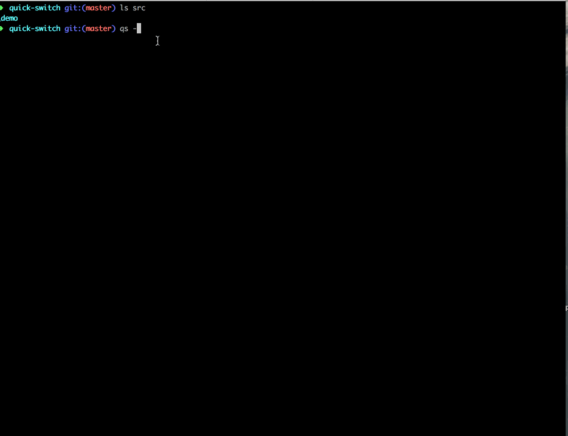

# qs

一个`NODE命令行工具`方便快速的根据已有模板快速生成新的模块，以命令行形式替代复制粘贴重命名，并且记录当前的模块，方便整合到 webpack，gulp 脚本中灵活的启动每模块

- [github](https://github.com/advence-liz/quick-switch)
- [npm](https://www.npmjs.com/package/quickly-switch)

```bash
比如有如下目录结构，每个组件的处除了父目录的名字其他的文件结构都是一样的,这样就可以根据 qs 命令快速的创建新的组件
$ qs --new=nav // 根据_demo 生成 nav
---
- componets
  + _demo
   - xxx
   - index.js


  + nav
   - xxx
   - index.js
---
```

## install

```bash
$ npm install quickly-switch -g
```

## 起步 `qs --init`

`--init` 主要是初始化 qs 的默认配置目前有两个个配置,生成的配置默认存在当前目录的 `.qsrc.json`文件中

- `root` 模板的根目录默认值为`.` (等同上文中的`components`)
- `defaultDemo` 默认模板默认值为 `_demo`结合`root`参数可以得其实际路径为`/components/_demo`（等同上文中`_demo`

```bash
$ qs --new=nav
会以_demo 为模板生成nav 并且将文件名字全部改为nav
_demo
 _demo.xx
 _demo.xxx
 _demo.XXXX

nav
 nav.xx
 nav.xxx
 nav.XXXX
```


## `.qsrc.json`

`.qsrc.json`文件由`qs --init`生成存储在`qs`命令的运行目录，文件中有三个属性 `root`为`qs`寻找和新建模块的根目录，`defaultDemo`默认的模板模块，`modeule`当前模块

```js
{"root":"src/components","defaultDemo":"_demo","module":"_demo"}
```

```js
// qs 命令会记录当前切换到那个模块下，那记录这个有什么用呢，举个例子
// 比如我们一个工程有多个模块，每个模块单独打包,这样就可以通过读取`.qsrc.json`获取当前模块动态打包

const { module: currentModule, root } = fs.readJsonSync('.qsrc.json')
module.exports = {
  entry: path.resolve(root, currentModule),
  mode: 'development',
  context: __dirname,
  output: {
    filename: 'bundle.js',
    path: path.resolve(__dirname, 'build')
  },
```

## 命令介绍

命令的实现依赖[yargs](https://github.com/yargs/yargs)

- `qs -h` 自行查看命令描述
- `qs` 直接键入`qs` 等同于 `qs -l`列出当项目的模块列表
- `qs --new=<name>` 根据默认模板创建新的模块
- `qs --switch=<name>` 将当前模块切换到对应名称的模块下,如果模块不存在则以当前模块为模板创建新的模块

### `qs -h`的输出

```
  pc git:(master) ✗ qs -h
Usage: qs [options]

选项：
  --version      显示版本号                                               [布尔]
  --new, -n      qs --new=<name> 跟默认模板创建新的模块<name>           [字符串]
  --switch, -s   qs --switch=<name> 将当前模块切换为<name>,如果<name>
                 不存在则以当前模块为模板创建新模块                     [字符串]
  --delete, -d   delete                                                 [字符串]
  --root, -r     root                                                   [字符串]
  --reset, --rs  reset Root                                               [布尔]
  --list, -l     列出所有模块                                             [布尔]
  --rename, -R   qs -s=<name> --rename
                 将新生产模块所有文件的名字改为跟模板目录相同,为了微信小程序那种形式
                                                                          [布尔]
  --init         主要是初始化 qs
                 的默认配置目前有三个配置,生成的配置默认存在当前目录的
                 `.qsrc`文件中
  -h, --help     显示帮助信息
```



## debug

将环境变量`DEBUG`设置为`qs` 当 debug 模式下会输出 qs 的配置和命令行参数信息,下面的信息具有时效性更新代表的时候输出就不一定这样喽

```js
   alg git:(master) export DEBUG=qs
➜  alg git:(master) qs
  qs isInit, rootDir false /xxx/workspace/alg +0ms
  qs options +0ms
  qs { defaultDemo: '_demo',
  qs   qsrcPath: 'xxxxxxxx/alg/.qsrc.json',
  qs   moduleStorePath: 'xxxxxxxx/alg/.qsrc.json',
  qs   rootDir: 'xxxxxxxx/alg',
  qs   currentModule: '_demo',
  qs   _: [],
  qs   '$0': 'qs',
  qs   root: '/Users/qudian/liz/workspace/alg' } +1ms
❤️ For more info use help: qs -h
_demo
```

## TODO

- [ ] root 动态设置 root
- [ ] sourcename 自定义源
